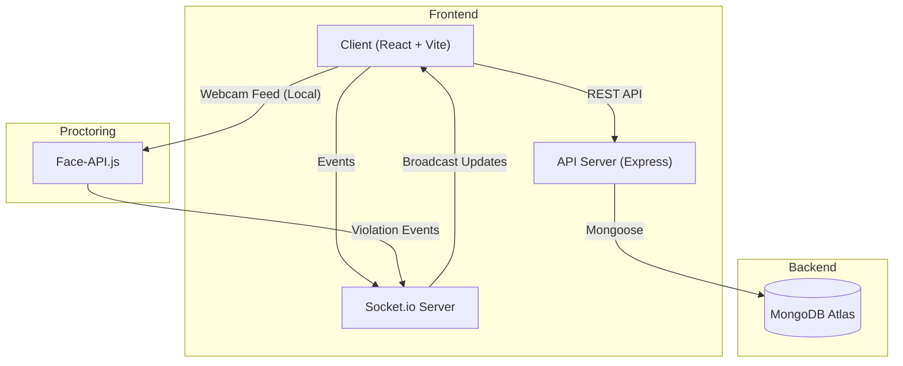

# AssessX 🚀

<div align="center">


### The Next-Gen Online Assessment Platform
*Secure, Real-time, and AI-Powered.*


[Features](#-key-features) • [Architecture](#-system-architecture) • [Screenshots](#-visual-tour) • [Installation](#-getting-started)

</div>

---

**AssessX** is a cutting-edge assessment platform designed to provide a secure and interactive environment for online testing. Built with the MERN stack and Socket.io, it ensures real-time integrity, instant feedback, and a premium user experience.

## ✨ Key Features

### 🛡️ Advanced Security
- **Proctoring Suite**: Automatically detects tab switching, full-screen exits, and multiple faces (Coming Soon: AI Eye Tracking).
- **Secure Environment**: Prevents copy-paste and right-click interactions during exams.

### ⚡ Real-time Performance
- **Live Sync**: Uses `Socket.io` to sync exam status, active students, and submissions instantly across Admin and Student portals.
- **Timer Synchronization**: Server-side timer validation prevents client-side manipulation.

### 🎨 Modern UI/UX
- **Glassmorphism Design**: sleek, translucent aesthetic using TailwindCSS.
- **Dark/Light Mode**: Fully responsive theme support for comfortable viewing in any lighting.
- **Smooth Animations**: Powered by `Framer Motion` and `GSAP` for a fluid experience.

## 🏗️ System Architecture

The application follows a standard **MERN** Service-Oriented Architecture with **Socket.io** for the real-time event loop.



## 📸 Visual Tour

### 🏠 Landing Page
The gateway to the platform, featuring a 3D Hero element and gradient-rich design.


### 🔐 Student Experience
A focused, distraction-free environment for students, available in your preferred theme.
| Light Mode | Dark Mode |
|:---:|:---:|
|  |  |

## 🛠️ Technology Stack

| Component | Technologies |
|-----------|------|
| **Frontend** | React 19, Vite, TailwindCSS, Framer Motion, GSAP, Three.js (@react-three/fiber) |
| **Backend** | Node.js, Express.js, Multer (File Uploads) |
| **Database** | MongoDB, Mongoose |
| **Real-time** | Socket.io |
| **AI (Beta)** | Face-api.js, TensorFlow.js |

## 🚀 Getting Started

1.  **Clone the Repository**
    ```bash
    git clone https://github.com/04shubham7/AssessX.git
    cd AssessX
    ```

2.  **Install Dependencies**
    ```bash
    # Root (Backend)
    npm install
    
    # Client (Frontend)
    cd client && npm install
    ```

3.  **Environment Setup**
    Create `.env` in `server/`:
    ```env
    PORT=5000
    MONGO_URI=your_mongodb_uri
    JWT_SECRET=your_jwt_secret
    ```

4.  **Launch**
    ```bash
    # Terminal 1: Backend
    npm run start
    
    # Terminal 2: Frontend
    cd client && npm run dev
    ```

## 📄 License
ISC License. © 2026 AssessX Inc.
