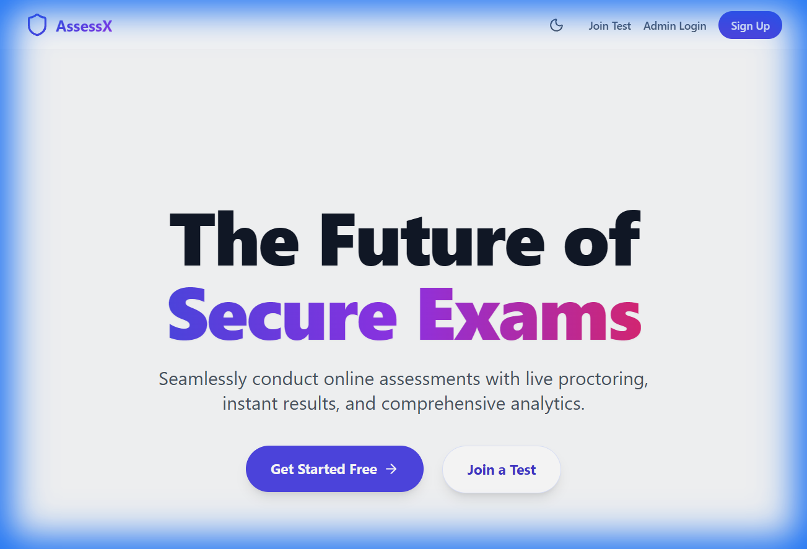

# AssessX

A comprehensive online assessment platform built with the MERN stack (MongoDB, Express, React, Node.js), featuring real-time capabilities via Socket.io.

## Features

- **Admin Dashboard**: Create and manage tests with various configurations.
- **Student Portal**: Take tests in a secure environment.
- **Real-time Updates**: Instant results and monitoring.
- **Visualizations**: 3D elements and smooth animations.

## Tech Stack
- **Frontend**: React, Vite, TailwindCSS, Framer Motion, GSAP, Three.js
- **Backend**: Node.js, Express, MongoDB
- **Real-time**: Socket.io

## Screenshots

### Landing Page


### Student Login


### Admin Login


## Getting Started

1. **Install Dependencies**:
   ```bash
   npm install
   cd client && npm install
   ```

2. **Run Application**:
   ```bash
   # Root directory (runs server)
   npm run start
   
   # in /client directory (runs frontend)
   npm run dev
   ```
