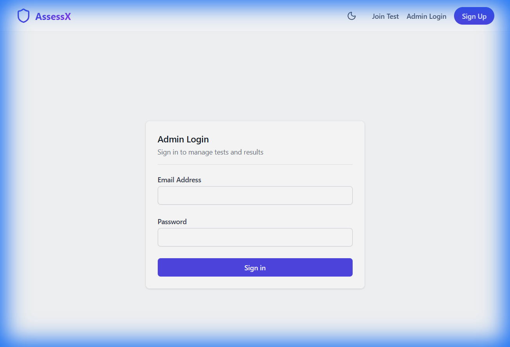
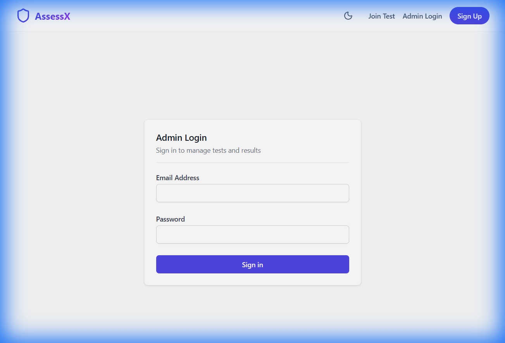

# AssessX 🚀

<div align="center">

<!--   -->
<!-- Replace with actual logo if available -->

### Modern Online Assessment Platform with Real-time Monitoring


</div>

---

**AssessX** is a cutting-edge assessment platform designed to provide a secure and interactive environment for online testing. Built with the MERN stack and Socket.io, it ensures real-time integrity and instant feedback.

## ✨ Key Features

- **🛡️ Secure Environment**: Real-time monitoring prevents malpractice with Tab-Switch detection and Fullscreen enforcement.
- **⚡ Real-time Updates**: Instant result calculation and status tracking via Socket.io.
- **👁️ AI Proctoring**: (Beta) Client-side eye tracking and webcam monitoring.
- **👨‍🏫 Admin Dashboard**: Comprehensive control to create, edit, and manage tests.
- **👨‍🎓 Student Portal**: Intuitive interface for taking exams with timer and progress saving.
- **📊 Visual Analytics**: Beautiful charts and graphs for result analysis.
- **🎨 Modern UI**: Built with TailwindCSS, Framer Motion, and GSAP. Features **Dark/Light Mode** and glassmorphism design.

## 🛠️ Technology Stack

| Component | Tech |
|-----------|------|
| **Frontend** | React 19, Vite, TailwindCSS, Framer Motion, GSAP, Three.js |
| **Backend** | Node.js, Express.js |
| **Database** | MongoDB, Mongoose |
| **Real-time** | Socket.io |
| **Authentication** | JWT (JSON Web Tokens) |

## 📸 Screenshots

### 🏠 Landing Page (New Redesign)


### 🔐 Student Login


### 👨‍💻 Admin Login


## 🚀 Getting Started

Follow these steps to set up the project locally.

### Prerequisites
- Node.js (v14 or higher)
- MongoDB (Local or Atlas URL)

### Installation

1.  **Clone the Repository**
    ```bash
    git clone https://github.com/04shubham7/AssessX.git
    cd AssessX
    ```

2.  **Install Server Dependencies**
    ```bash
    npm install
    ```

3.  **Install Client Dependencies**
    ```bash
    cd client
    npm install
    cd ..
    ```

4.  **Environment Setup**
    - Create a `.env` file in the `server` directory:
      ```env
      PORT=5000
      MONGO_URI=your_mongodb_connection_string
      JWT_SECRET=your_secret_key
      ```

5.  **Run the Application**
     Open two terminals:
    
    *Terminal 1 (Server):*
    ```bash
    npm run start
    ```
    
    *Terminal 2 (Client):*
    ```bash
    cd client
    npm run dev
    ```

## 🤝 Contributing

Contributions are welcome! Please feel free to submit a Pull Request.

## 📄 License

This project is licensed under the ISC License.
