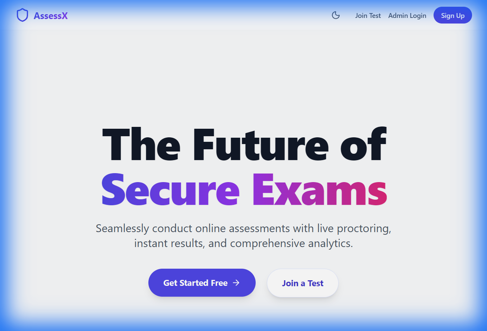
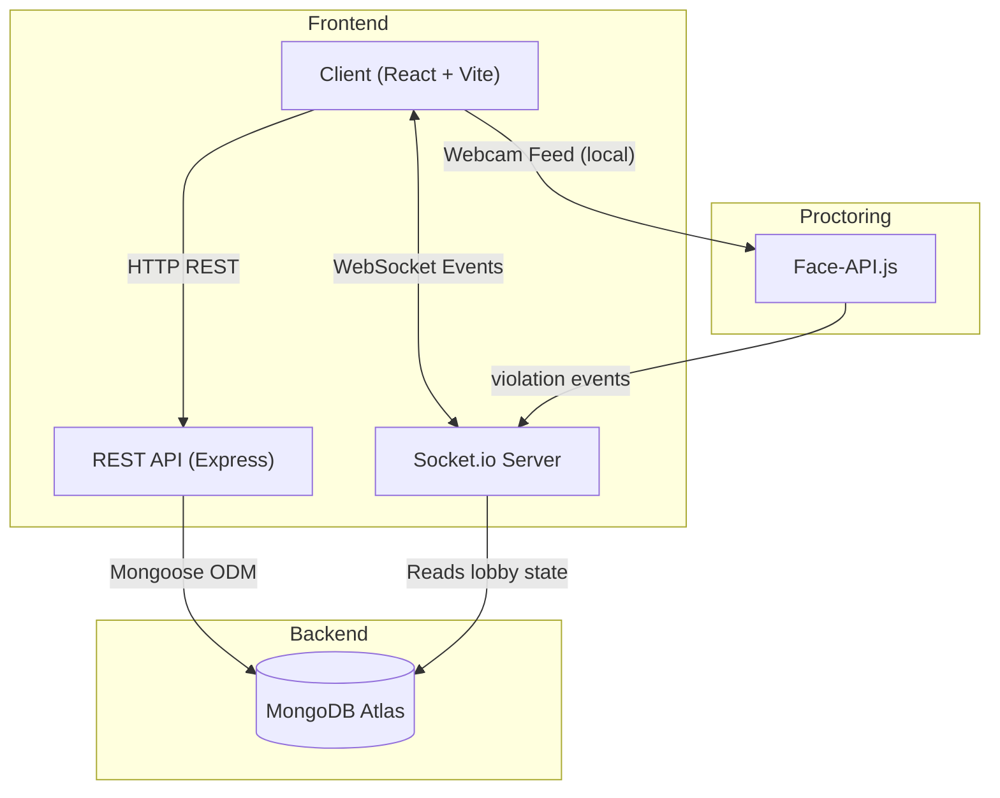
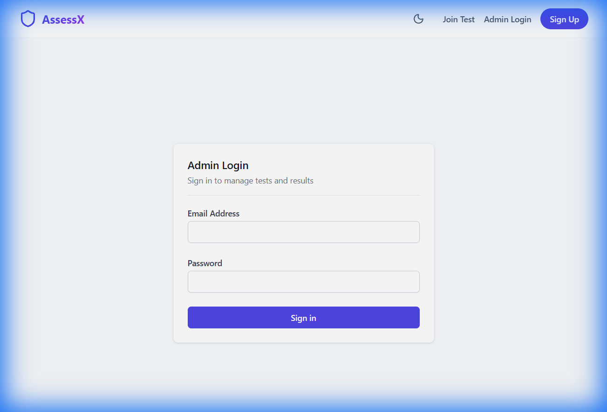
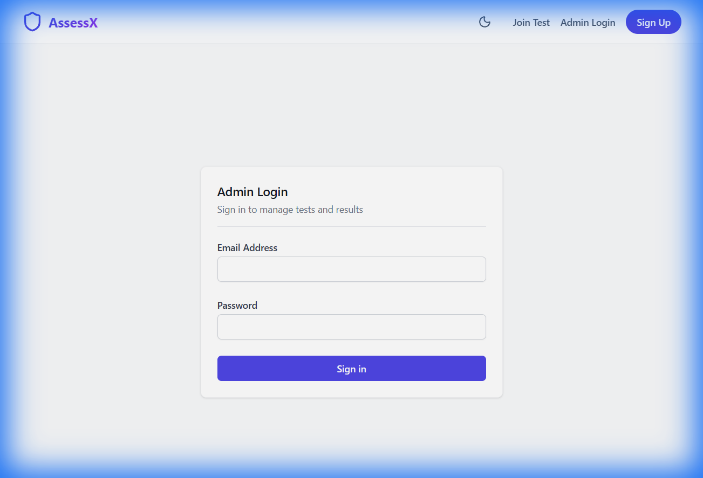

# AssessX 🚀

<div align="center">



### The Next-Gen Online Assessment Platform
*Secure, Real-time, and AI-Powered.*

[](https://nodejs.org/)
[](https://expressjs.com/)
[](https://react.dev/)
[](https://www.mongodb.com/)
[](https://socket.io/)
[](https://tailwindcss.com/)

[Features](#-key-features) • [Architecture](#-system-architecture) • [Screenshots](#-visual-tour) • [API](#-api-reference) • [Installation](#-getting-started) • [Contributing](#-contributing)

</div>

---

**AssessX** is a full-stack online assessment platform built for educators and institutions who need a secure, real-time testing environment. Powered by the **MERN stack** and **Socket.io**, it delivers live lobby management, automatic proctoring, instant result analytics, and a polished modern UI — all in a single deployable application.

---

## ✨ Key Features

### 🛡️ Advanced Proctoring
- **Tab-Switch Detection** — flags students who navigate away from the exam window.
- **Full-Screen Enforcement** — alerts triggered when a student exits full-screen mode.
- **AI Face Detection** — powered by `Face-API.js` to detect multiple faces or an absent student via webcam (beta).
- **Copy-Paste & Right-Click Disabled** — prevents content extraction during the exam.
- **Real-time Violation Alerts** — every proctoring event is broadcast instantly to the admin dashboard.

### ⚡ Real-time Exam Management
- **Live Lobby** — students join a lobby by entering a 6-digit test code; the admin sees the participant list update in real time via `Socket.io`.
- **One-Click Start / Force Stop** — the admin can start the exam for all connected students simultaneously or force-end it at any time.
- **Server-side Timer** — the exam start timestamp is issued by the server, preventing client-side timer manipulation.
- **Automatic Submission** — when time runs out or the admin stops the test, all clients submit automatically.

### 📝 Flexible Question Builder
- **Question Types**: Single-choice (MCQ), Multiple-choice, and Subjective (open-ended).
- **Per-Question Marks** — assign custom mark values to each question.
- **Optional Negative Marking** — configurable at the test level.
- **Question Shuffle** — randomise question order per student.
- **Image & File Attachments** — attach images to questions; students can upload files for subjective answers.

### 📊 Result & Analytics
- **Instant Score Calculation** — objective questions are auto-graded server-side upon submission.
- **Detailed Answer Review** — admin can inspect each student's response, correctness, and marks awarded.
- **Leaderboard View** — results sorted by score (desc) then time taken (asc).
- **Violation Log** — violation count per student is saved alongside the result.

### 🎨 Modern UI/UX
- **Glassmorphism Design** — sleek translucent aesthetic with TailwindCSS.
- **Dark / Light Mode** — context-driven theme switch with smooth transitions.
- **3D Hero Element** — interactive Three.js scene on the landing page (`@react-three/fiber`).
- **Smooth Animations** — `Framer Motion` and `GSAP` power page transitions and micro-interactions.

---

## 🏗️ System Architecture

AssessX follows a **MERN Service-Oriented Architecture** with a dedicated **Socket.io** layer for real-time bidirectional communication.


```mermaid
graph TD
    Client["Client (React + Vite)"]
    Server["REST API (Express)"]
    DB[("MongoDB Atlas")]
    Socket["Socket.io Server"]

    subgraph Frontend
        Client -->|HTTP REST| Server
        Client <-->|WebSocket Events| Socket
    end

    subgraph Backend
        Server -->|Mongoose ODM| DB
        Socket -->|Reads lobby state| DB
    end

    subgraph Proctoring
        Client -- "Webcam Feed (local)" --> FaceAPI["Face-API.js"]
        FaceAPI -- "violation events" --> Socket
    end
```

### Request Flow

| Event | Transport | Description |
|-------|-----------|-------------|
| Admin creates test | REST `POST /api/tests` | Persisted to MongoDB with auto-generated test code |
| Student joins lobby | Socket `join-lobby` | In-memory lobby created / updated; admin notified |
| Admin starts exam | Socket `start-test` | Server broadcasts `test-started` with canonical start time |
| Student submits | Socket `submit-test` | Server grades answers and persists `Result` document |
| Admin views results | REST `GET /api/results/:testId` | Sorted leaderboard returned from MongoDB |

---

## 📸 Visual Tour

### 🏠 Landing Page
An animated landing page with an interactive 3D hero element and gradient-rich design.


### 🔐 Admin Portal
Secure admin login to manage tests, monitor live lobbies, and review results.



### 🎓 Student Portal
A focused, distraction-free entry point for students to join an exam with a test code.



---

## 🛠️ Technology Stack

| Layer | Technologies |
|-------|-------------|
| **Frontend** | React 19, Vite, React Router v7, TailwindCSS, Radix UI, Framer Motion, GSAP, Three.js / `@react-three/fiber` |
| **Backend** | Node.js, Express.js 5, Multer (file uploads) |
| **Database** | MongoDB, Mongoose |
| **Real-time** | Socket.io 4 |
| **Auth** | JSON Web Tokens (JWT), bcryptjs |
| **AI / Proctoring** | Face-API.js, TensorFlow.js (beta) |

---

## 🚀 Getting Started

### Prerequisites

| Requirement | Version |
|-------------|---------|
| Node.js | ≥ 18.x |
| npm | ≥ 9.x |
| MongoDB | Atlas cluster **or** local instance |

### 1 · Clone the repository

```bash
git clone https://github.com/04shubham7/AssessX.git
cd AssessX
```

### 2 · Install dependencies

```bash
# Backend (root)
npm install

# Frontend
cd client && npm install
```

### 3 · Configure environment variables

Copy the example file and fill in your values:

```bash
cp server/.env.example server/.env
```

```env
# server/.env
PORT=5000
MONGO_URI=mongodb+srv://<user>:<password>@cluster.mongodb.net/assessx
JWT_SECRET=replace_with_a_long_random_secret
```

> **Tip:** Generate a strong `JWT_SECRET` with:
> ```bash
> node -e "console.log(require('crypto').randomBytes(64).toString('hex'))"
> ```

### 4 · Run the application

Open two terminal windows:

```bash
# Terminal 1 — Backend API + Socket server
npm run start
# → Server running on http://localhost:5000

# Terminal 2 — Frontend dev server
cd client && npm run dev
# → React app running on http://localhost:5173
```

---

## 📁 Project Structure

```
AssessX/
├── client/                  # React + Vite frontend
│   └── src/
│       ├── components/      # Shared UI components (Navbar, Layout, ProctoringContainer, …)
│       ├── context/         # React contexts (SocketContext, ThemeContext)
│       ├── hooks/           # Custom hooks (use-toast)
│       ├── pages/
│       │   ├── Admin/       # Dashboard, CreateTest, LobbyControl, TestResults
│       │   └── Student/     # StudentLogin, WaitingRoom, ExamPortal, ResultSummary
│       └── lib/             # Utility helpers
├── server/                  # Express + Socket.io backend
│   ├── controllers/         # authController, testController, resultController
│   ├── middleware/          # authMiddleware (JWT protect), uploadMiddleware (Multer)
│   ├── models/              # Mongoose schemas (Admin, Test, Result)
│   ├── routes/              # authRoutes, testRoutes, resultRoutes
│   ├── socket/              # socketHandler.js — all real-time event logic
│   └── server.js            # Entry point
├── docs/                    # Screenshots for documentation
└── scripts/                 # Seed / utility scripts
```

---

## 📡 API Reference

All REST endpoints are prefixed with `/api`. Protected routes require a `Bearer <token>` header.

### Auth — `/api/auth`

| Method | Endpoint | Access | Description |
|--------|----------|--------|-------------|
| `POST` | `/register` | Public | Register a new admin account |
| `POST` | `/login` | Public | Authenticate and receive JWT |
| `GET` | `/me` | Private | Get current admin profile |

### Tests — `/api/tests`

| Method | Endpoint | Access | Description |
|--------|----------|--------|-------------|
| `POST` | `/` | Private | Create a new test (auto-generates 6-digit code) |
| `GET` | `/` | Private | List all tests owned by the admin |
| `GET` | `/:id` | Private | Get full test details by ID |
| `DELETE` | `/:id` | Private | Delete a test |
| `GET` | `/code/:testCode` | Public | Fetch test info by code (answers stripped) |
| `POST` | `/upload` | Public | Upload a file attachment; returns file path |

### Results — `/api/results`

| Method | Endpoint | Access | Description |
|--------|----------|--------|-------------|
| `GET` | `/:testId` | Private | Get sorted results for a test |

### Socket.io Events

| Event | Direction | Payload | Description |
|-------|-----------|---------|-------------|
| `admin-join` | Client → Server | `{ testCode }` | Admin subscribes to lobby updates |
| `join-lobby` | Client → Server | `{ testCode, studentName, rollNumber, mobileNumber }` | Student enters waiting room |
| `start-test` | Client → Server | `{ testCode }` | Admin broadcasts exam start |
| `stop-test` | Client → Server | `{ testCode }` | Admin force-ends the exam |
| `submit-test` | Client → Server | `{ testCode, answers, timeTaken, violationCount }` | Student submits answers |
| `proctoring-violation` | Client → Server | `{ testCode, type }` | Student reports a proctoring event |
| `lobby-update` | Server → Client | `{ count, students[] }` | Live participant list |
| `test-started` | Server → Client | `{ startTime, duration }` | Exam begins for all students |
| `test-ended` | Server → Client | — | Force-submission trigger |
| `proctoring-alert` | Server → Admin | `{ studentName, rollNumber, type, violationCount, time }` | Violation notification |
| `result-published` | Server → Student | `{ score, total }` | Post-submission score |

---

## 🤝 Contributing

Contributions are welcome! Please follow these steps:

1. **Fork** the repository and create your feature branch:
   ```bash
   git checkout -b feature/your-feature-name
   ```
2. **Commit** your changes with a descriptive message:
   ```bash
   git commit -m "feat: add your feature"
   ```
3. **Push** to your fork and open a **Pull Request** against `main`.

Please make sure your code:
- Follows the existing code style (ESLint config is included for the frontend).
- Does not introduce breaking changes to existing API contracts or Socket.io events.
- Includes a brief description of the change in the PR body.

### Reporting Issues

Found a bug or have a feature request? [Open an issue](https://github.com/04shubham7/AssessX/issues) with as much context as possible.

---

## 📄 License

Distributed under the **ISC License**. See [`package.json`](./package.json) for details.

© 2026 AssessX. Built with ❤️ by [04shubham7](https://github.com/04shubham7).
